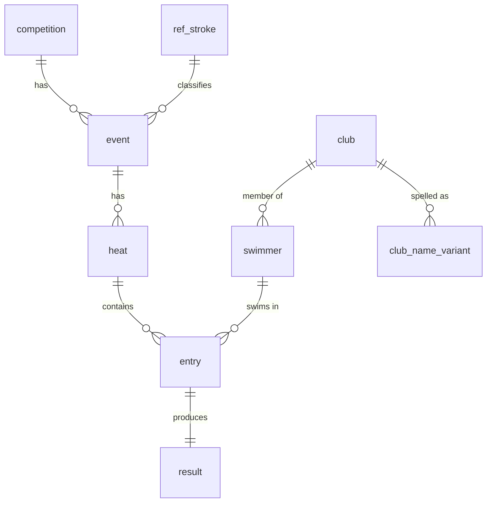

<div dir="rtl">

# SwimData-IL — שילוב תוצאות איגוד השחייה במסד נתונים יחסי

**ניהול נתונים, אוניברסיטת בן־גוריון — אביב 2026 · דוח פרויקט גמר**
אסף בלילוס · https://github.com/Belilus/swimdata-il · הגשה 2026-07-27

> יעד אורך: עד 5 עמודים. המספרים למטה הופקו מהצינור האמיתי במאגר, מול אליפות אמיתית של האיגוד.
> גרסה באנגלית: `report.md`

---

## 1. סקירת היישום

**SwimData-IL** קולט את התוצאות הרשמיות של תחרויות איגוד השחייה בישראל — שמתפרסמות רק כ־PDF — והופך אותן למסד נתונים יחסי מנורמל שעונה על שאלות שה־PDF לא יכול: פודיום לכל משחה, טבלת מדליות למועדונים, התקדמות מזמן זינוק לזמן גמר, שיאי קבוצת גיל, ספורטאים רב־משחיים, וניתוח פסילות. אפליקציית מסוף קטנה מריצה את אלה כשאילתות עם פרמטרים; לפי המפרט, הדגש הוא על **ניהול נתונים, לא על ממשק**.

במסד יש **שתי אליפויות אמיתיות**: *מוקדמות אליפות ארנה ישראל קיץ 2026 לגילאים צעירים — דרום* (תחרות משני מקורות) ו־*אליפות ישראל ארנה נוער ובוגרים חורף 2025* (יורדה ופורסרה מ־loglig) — יחד **4,770 שחיות** ב־**340 משחים** ו־**894 מקצים**, שיושבו ל־**1,311 שחיינים** ב־**72 מועדונים**, עם **אפס מפתחות זרים יתומים**. כל תחרות לבדה (למשל 1,701 שחיות / 74 משחים / 496 שחיינים / 39 מועדונים בראשונה) היא מערך שלם; השתיים יחד מוסיפות ממד זהות חוצה־תחרויות (המנגנון קיים; בזוג הזה אין חפיפת שחיינים).

## 2. מקורות הנתונים

כל הנתונים ציבוריים, דרך `isr.org.il/Competitions.ASP`, שמקשר לספק התזמון **loglig.com**. לכל תחרות יש שלושה קובצי PDF:

| מקור | שפה | מה הוא תורם |
|--------|----------|---------------------|
| **תוצאות** | אנגלית | דירוג, מקצה, מסלול, שחיין, שנת לידה, מועדון, זמן גמר, נקודות FINA, סטטוס (DNS/DQ/…) |
| **רשימת זינוק** | עברית (מימין לשמאל) | שיוך מסלול, **קוד מועדון מספרי**, **זמן זינוק** (או `NT`), שמות שחיינים ומועדונים בעברית |
| **תקנון** | עברית | זכאות, קבוצות גיל, מגבלת משחים — לאימות אילוצים (למשל עד 4 משחים לשחיין; בנתונים המקסימום הוא 4) |

ה־PDF הוא **דוח עמודות קבועות בלי שכבת נתונים**: חילוץ טקסט תמים (`pdftotext`) מערבב עמודות בגלל כותרות עבריות, רהיטי עמוד שחוזרים, ושמות מועדונים שנשברים על 2–3 שורות. לכן אני מפרסר לפי **גיאומטריה** — קורא כל מילה עם קואורדינטות `(x, y)` ב־`pdfplumber`, משחזר את פסי העמודות, ומעגן כל שחיין על אסימון שנת הלידה, ואז מצמיד כל מילה אחרת לעוגן הקרוב. זה הצעד "נתונים גולמיים → מובנים" שהקורס נפתח בו.

## 3. אתגרי ניהול הנתונים

האתגר המרכזי הוא **פתרון ישויות דו־לשוני ממקורות מרובים**, יחד עם ערכים חסרים ובעיות פירוס שיוצאות מ־PDF אמיתי.

**(א) אינטגרציה בין שפות.** התוצאות (אנגלית) ורשימת הזינוק (עברית) חייבות להתאחד לזהות אחת. התובנה: שני הקבצים חולקים את הרביעייה **(חתימת משחה, מקצה, מסלול)**, וברשימת הזינוק יש **קוד מועדון מספרי ניטרלי לשפה**. חיבור על `(מרחק, סגנון, מגדר, גיל, מקצה, מסלול)` מתאים **1,672 מתוך 1,701 שורות (98.3%)** אחד־לאחד בלי עמימות, ודרך הגשר הזה כל שם/מועדון אנגלי נקשר לעברית ולקוד האיגוד — דטרמיניסטית, לא בתעתיק מטושטש. **29 השורות הנותרות (1.7%) לא נזרקות:** זה `LEFT JOIN` מהתוצאות אל רשימת הזינוק. התוצאות הן עובדת האמת; רשימת הזינוק רק מעשירה. בלי התאמה (משיכה / החלפת מסלול) נשארים `NULL` בקוד המועדון, בשם העברי ובזמן הזינוק — ערך חסר כנה, לא ניחוש לפי שם. `RIGHT JOIN` היה שומר נרשמים בלי שורת תוצאות; גרעין הטעינה הוא שורת תוצאה, ולכן נשארים עם `LEFT JOIN`.

**(ב) איחוד מועדונים / קנוניזציה.** אותו מועדון מאוית בהרבה צורות: הקידומת "מכבי" מופיעה כ־*Macabbi / Maccabi / Maccabbi / Macabi*; גם הרישיות לא עקבית. קיבוץ לפי שם היה סופר מועדונים יתר על המידה ואפילו מפצל מועדון אחד לשניים. אני מזהה כל מועדון לפי **קוד האיגוד** ובוחר את **השם הקנוני לפי השכיח ביותר** (`ROW_NUMBER() … ORDER BY count DESC`), ושומר כל איות שנצפה בטבלת ביקורת `club_name_variant`. התוצאה: **72 איות גולמיים מתכווצים ל־39 מועדונים**. הצעד הזה גם *מרפא פגם בנתונים*: אסימון `DNF` שדלף לתא המועדון יצר את האיות המזויף `Maccabi Rishon Seals DNF` (פעם אחת) — המוד מוריד אותו לטובת האיות הנקי שנראה 109 פעמים. שלושה מועדוני ירושלים שונים באמת (*הפועל*, *מכבי*, *Greater Jerusalem*) **לא** מאוחדים, כי הקודים שונים.

**(ג) ערכים חסרים ומיוחדים.** תוצאה היא **או** זמן **או** סטטוס — אף פעם לא שניהם ולא אף אחד — ואכיפה ב־`CHECK`. זמן זינוק יכול להיעדר (`NT`) וחייב להישאר `NULL`, *לא* אפס; שאילתת השיפור הגדול ביותר לכן מוציאה רשומות `NT` במקום לתת להן ירידה אינסופית. `DNS/DQ/DNF/NS` מנורמלים (`DQ → DSQ`) והפניית חוק FINA (למשל `SW 4.4`) נשמרת בעמודה נפרדת. **בתחרות הראשונה, 6 מועדונים בלי שם אנגלי בכלל** — ערך חסר אמיתי, שמטופל בנפילה לשם העברי (`COALESCE`).

## 4. תכנון המסד

שני קובצי ה־PDF הם למעשה **יחס רחב אחד לא מנורמל**, עם כפילות כבדה (שם מועדון ותכונות משחה חוזרים בכל שורת שחיין) ועם אנומליות הכנסה/עדכון/מחיקה הקלאסיות. אני מפרק ל־**BCNF**: כל תלות פונקציונלית לא טריוויאלית (`federation_code → שם מועדון`, `event_id → מרחק, סגנון, מגדר, גיל`, `entry_id → result`) הופכת לטבלה משלה, כדי שכל עובדה תישמר פעם אחת.



החלטות מפתח: **`club.federation_code`** הוא מפתח טבעי ייחודי (עוגן הזהות); **`entry`** (רשום) ו־**`result`** (שחו) מפוצלים 1־ל־1 כדי שספורטאי שנרשם ולא עלה לזינוק ימודל בכנות; `ref_stroke` היא טבלת ערכים ולא טקסט חופשי; זמנים נשמרים כ־**אלפיות שנייה שלמות** (מדויק, ניתן למיון, ידידותי לאינדקס) ומעוצבים רק בתצוגה. השלמות נאכפת במפתחות ראשיים, שבעה מפתחות זרים, אילוצי `UNIQUE` (`club.federation_code`, `heat(event_id, heat_no)`, `entry(heat_id, lane)`, `result.entry_id`), אילוצי תחום (`distance_m ∈ {25,…,1500}`, מגדר, קודי סטטוס, טווח שנת לידה 1930–2020), וכלל "זמן או סטטוס". האינדקסים נבחרים לפי עומס השאילתות (ראו סעיף 5).

## 5. שאילתות מייצגות

הסט המלא ב־`sql/04_queries.sql`; כל שאילתה מסומנת במושג מהקורס. שני דוגמאות:

**Q1 — פודיום לכל משחה** (פונקציות חלון, לוגיקה תלת־ערכית):

```sql
SELECT distance_m, stroke, gender, age_group, podium,
       first_name_en, last_name_en, club, final_time
FROM (
  SELECT f.*, RANK() OVER (PARTITION BY event_id ORDER BY final_time_ms) AS podium
  FROM v_fmt f
  WHERE final_time_ms IS NOT NULL   -- DSQ/DNS לא יכולים לקחת מדליה
) t
WHERE podium <= 3;
```

**Q3 — דירוג מועדונים** (צירוף + אגרגציה מותנית):

```sql
SELECT COALESCE(c.name_en, c.name_he) AS club,
       COUNT(*) FILTER (WHERE r.place = 1) AS gold,
       COUNT(*) FILTER (WHERE r.place = 2) AS silver,
       COUNT(*) FILTER (WHERE r.place = 3) AS bronze,
       COUNT(DISTINCT en.swimmer_id) AS swimmers
FROM result r
JOIN entry en ON en.entry_id = r.entry_id
JOIN swimmer sw ON sw.swimmer_id = en.swimmer_id
JOIN club c ON c.club_id = sw.club_id
GROUP BY 1 ORDER BY gold DESC;
```

שאילתות נוספות במאגר: שיפור זינוק→גמר (חשבון בטוח ל־NULL; הירידה הגדולה **48.84 שניות**), `GROUP BY … HAVING` (מועדונים עם לפחות 10 שחיינים), ביקורת פתרון זהויות (`STRING_AGG` על `club_name_variant`), ניתוח פסילות (`GROUP BY dsq_rule`; `SW 4.4` הנפוץ ביותר, 10 פעמים), ו־`INTERSECT` (שחיינים גם בחופשי וגם בפרפר).

**אינדקסים ותוכניות (`sql/05_indexes_explain.sql`).** חיבור להרצאות *Server*: עץ B+ מורכב `swimmer(last_name, first_name, birth_year)` משרת חיפוש לפי קידומת שם (הסדר חשוב); `result(final_time_ms)` תומך בדירוג / `ORDER BY … LIMIT`; עמודות מפתח זר ממאונדקסות כדי שהמייעל יוכל לבחור **לולאה מקוננת עם אינדקס** במקום לולאה בלוקית בצירוף הכוכב `result→entry→heat→event→swimmer`. `EXPLAIN` לפני ואחרי `DROP INDEX` מדגים את השינוי בתוכנית ובעלות.

## 6. מאגר ושחזור

**GitHub:** https://github.com/Belilus/swimdata-il (קוד, סכימה, SQL, מפרסרים).

`bash build.sh` מריץ PDF → CSV → אחסון ביניים → ליבה מנורמלת → אימות על DuckDB (בלי שרת); ה־DDL הקנוני מיועד ל־PostgreSQL. האימות בודק ספירות שורות ו**אפס מפתחות זרים יתומים**.

</div>
