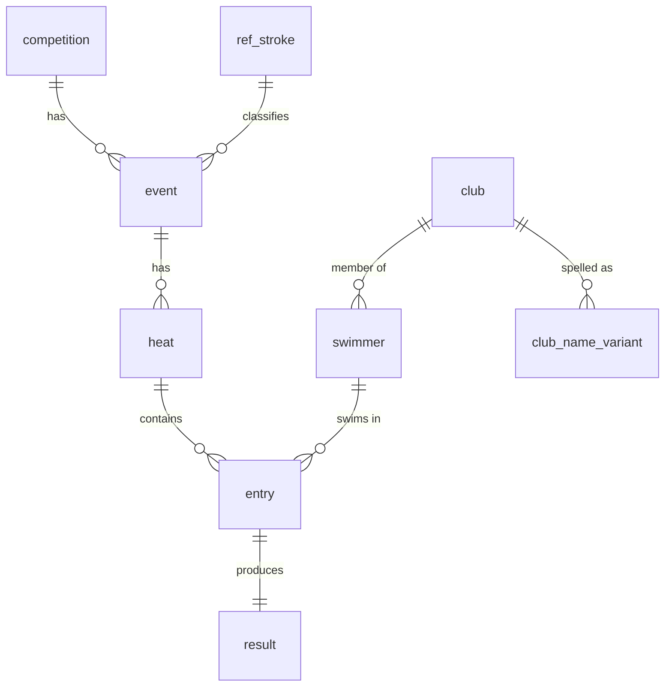

# SwimData-IL — Integrating Israeli Swimming Association Results into a Relational Database

**Data Management, BGU — Spring 2026 · Final Project Report**
Asaf Belilus · https://github.com/Belilus/swimdata-il · Due 2026-07-20

> Target length ≤ 5 pages. Figures/numbers below are produced by the actual
> pipeline in this repository against one real ISA championship.

---

## 1. Application overview

**SwimData-IL** ingests the official results of Israeli Swimming Association (ISA)
competitions — published only as PDF — and turns them into a normalised relational
database that answers questions the PDFs cannot: podiums per event, club medal
tables, personal-best progressions (seed vs. final), age-group records, multi-event
athletes, and disqualification analysis. A small console application runs these as
parameterised SQL queries; the emphasis, per the brief, is on **data management, not
UI**.

The database holds **two real championships**: *Arena Israel Summer 2026 Youth
Championship (South)* (a two-source young-ages meet) and the *Arena Israel National
Winter Championship 2025 (Youth & Seniors)* (downloaded and parsed from loglig) —
together **4,770 swims** across **340 events** and **894 heats**, resolved to
**1,311 swimmers** in **72 clubs**, with **zero orphan foreign keys**. Each meet
alone (e.g. 1,701 swims / 74 events / 496 swimmers / 39 clubs for the first) is a
complete dataset; the two together add a **cross-meet** identity dimension.

## 2. Data sources and description

All data is public, published by the ISA via `isr.org.il/Competitions.ASP`, which
links to the timing provider **loglig.com**. Each competition exposes three PDFs:

| Source | Language | What it contributes |
|--------|----------|---------------------|
| **Results** | English | rank, heat, lane, swimmer, birth year, club, final time, FINA points, status (DNS/DQ/…) |
| **Start list** | Hebrew (RTL) | lane assignment, **numeric club code**, **seed time** (or `NT`), Hebrew swimmer & club names |
| **Regulations** (*תקנון*) | Hebrew | eligibility, age groups, entry limits — used to validate constraints (e.g. ≤ 4 events/swimmer, which the data confirms: max = 4) |

The PDFs are **fixed-column reports with no data layer**: naive text extraction
(`pdftotext`) scrambles the columns because of RTL Hebrew headers, repeated page
furniture, and club names that wrap across 2–3 lines. I therefore parse by
**geometry** — reading each word with its `(x, y)` coordinates (`pdfplumber`),
recovering the column bands empirically, and anchoring each swimmer on their
year-of-birth token, then assigning every other word to its nearest anchor. This is
the project's "raw-data → structured" step, exactly the pipeline the course opened
with (*intro*: raw data → cleaning → structured DB → efficient queries).

## 3. Data-management challenges

The headline challenge is **multi-source bilingual entity resolution**, plus the
missing-value and parsing challenges that fall out of real PDFs.

**(a) Cross-language integration.** The results (English) and start list (Hebrew) must
be reconciled into one swimmer/club identity. My key observation: both PDFs share the
tuple **(event-signature, heat, lane)**, and the start list carries a **language-neutral
numeric club code**. Joining on `(distance, stroke, gender, age, heat, lane)` matches
**1,672 / 1,701 rows (98.3 %) one-to-one with zero ambiguity**, and through that bridge
each English name/club is tied to its Hebrew counterpart and to the federation code —
deterministically, not by fuzzy transliteration.

**(b) Club de-duplication / canonicalisation.** The same club is spelled many ways in
the results: the "Maccabi" prefix alone appears as *Macabbi / Maccabi / Maccabbi /
Macabi*; casing is inconsistent (`hapoel bat-yam swimming club` vs
`GREATER JERUSALEM SWIMMING CLUB`). Naively grouping by name would over-count clubs and
even split one club in two. I key every club on its **federation code** and pick the
**canonical name by statistical mode** (a window `ROW_NUMBER() … ORDER BY count DESC`),
recording every observed spelling in a `club_name_variant` audit table. Result: **72
raw spellings collapse to 39 clubs**. This step even *self-heals a data defect*: a
`DNF` status token that leaked into one club cell created the bogus spelling
`Maccabi Rishon Seals DNF` (seen once) — the mode correctly demotes it in favour of the
109-times-seen clean spelling. Three genuinely different Jerusalem clubs
(*Hapoel*, *Maccabi*, *Greater Jerusalem*) are **not** merged, because their codes
differ.

**(c) Missing & special values.** A result is **either** a time **or** a status — never
both — enforced by a table `CHECK`. Seed times may be absent (`NT` = no time) and must
stay `NULL`, *not* be treated as zero; the query for biggest improvement therefore
excludes `NT` entries rather than crediting them an infinite drop. `DNS/DQ/DNF/NS` are
normalised (`DQ → DSQ`) and their FINA rule reference (e.g. `SW 4.4`) is captured as its
own column, enabling a "most common disqualification reason" query. **6 clubs have no
English name anywhere in the source** (they print in Hebrew even in the English PDF) — a
true missing value, handled by falling back to the Hebrew name (`COALESCE`).

## 4. Database design

The two PDFs are effectively **one wide, unnormalised relation** with heavy redundancy
(club name and event attributes repeat on every swimmer row) and the classic
insertion/update/deletion anomalies. I decompose to **BCNF**: every non-trivial
functional dependency (`federation_code → club name`, `event_id → distance, stroke,
gender, age`, `entry_id → result`) becomes its own table, so each fact is stored once.

Key design decisions: **`club.federation_code`** is a natural unique key (the identity
anchor for entity resolution); **`entry`** (seeded) and **`result`** (swum) are split
1-to-1 so an athlete who entered but did not start is modelled honestly; `ref_stroke`
is a lookup table (FK from `event`) rather than a free-text column; times are stored as
**integer milliseconds** (exact, sortable, index-friendly) and formatted only on
display. Integrity is enforced with primary keys, seven foreign keys, `UNIQUE`
constraints (`club.federation_code`, `heat(event_id, heat_no)`, `entry(heat_id, lane)`,
`result.entry_id`), domain `CHECK`s (`distance_m ∈ {25,…,1500}`, `gender`, valid status
codes, birth-year range), and the "time XOR status" rule. Indexes are chosen for the
query workload (see §5).

## 5. Representative SQL queries

The full set is in `sql/04_queries.sql`; each is tagged with the course concept it
exercises. Highlights:

- **Podium per event** — `RANK() OVER (PARTITION BY event ORDER BY time)`, filtering
  `final_time_ms IS NOT NULL` so a DSQ cannot take a medal (*window functions*,
  *3-valued logic*).
- **Seed → final improvement** — arithmetic across the two integrated sources with
  correct `NULL` handling for `NT` entries. Top drop: **48.84 s** (YOSEF ROUD, 800 Free).
- **Club standings** — multi-table join + `COUNT(… ) FILTER (WHERE place=1)` conditional
  aggregation, `GROUP BY`, `ORDER BY` (*aggregation*).
- **`GROUP BY … HAVING`** — clubs fielding ≥ 10 swimmers (post-aggregate filter).
- **Entity-resolution audit** — clubs ranked by number of spelling variants
  (`STRING_AGG`), turning the data-quality work into a query.
- **Disqualification analysis** — `GROUP BY dsq_rule`; `SW 4.4` (false start) is the most
  common, 10×.
- **`INTERSECT`** — swimmers who raced both Freestyle and Butterfly (*set operators*).

**Indexing & plans (`sql/05_indexes_explain.sql`).** Ties to the *Server* lectures:
a composite B+-tree `swimmer(last_name, first_name, birth_year)` serves prefix name
lookups (order matters); `result(final_time_ms)` supports the ranking/`ORDER BY … LIMIT`
access path (sorted scan vs. full heap scan + sort); FK columns are indexed so the
optimiser can pick **index-nested-loop** over block-nested-loop on the
`result→entry→heat→event→swimmer` star join. `EXPLAIN`/`EXPLAIN ANALYZE` before and
after `DROP INDEX` demonstrate the plan and cost change.

## 6. Reproducibility

`python3 src/run_pipeline.py` runs the whole chain — PDF → CSV → staging → normalised
core → verification — into an embedded database with zero server setup. The canonical
schema (`sql/01_schema.sql`) and transformation (`sql/03_transform.sql`) are written for
**PostgreSQL**; the runner executes the identical SQL on DuckDB for a one-command demo.
Verification asserts row counts and **zero orphan foreign keys**.

## 7. Limitations & future work

Relay events and split times are out of scope for this meet (none present) but the
schema accommodates them. A handful of long names split at a column seam
(`ALEXSAND ER`) — a residual OCR-band artifact. Scaling to many competitions
(cross-meet swimmer identity, true personal-best history over time) is the natural
extension — and the same normalised model feeds the SwimEdge product: the geometry
parsers were ported into SwimEdge's ingestion tooling, and a one-way adapter
(`swimedge_adapter.py`) maps this database onto SwimEdge's import bundle with
zero enum mismatches. Full results ingestion (canonical model + backend service)
was implemented in SwimEdge after the course project shipped; it is documented in
`docs/swimedge-sync.md` but is not a dependency for this submission.
